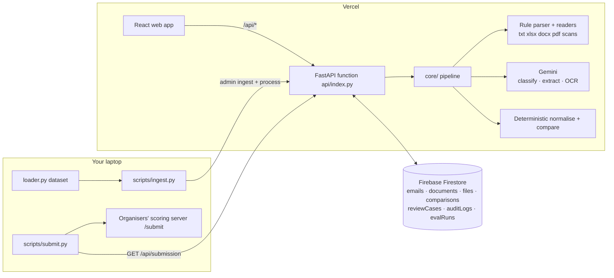

# Shippeo

**Where shipping documents reveal their parallel realities.**

AI-powered shipping-document verification. Shippeo classifies every email in a shipping
operations inbox and, for document-comparison requests, compares the **Shipping Instruction (SI)**
against the **draft Bill of Lading (BL)** across seven fields, explains every discrepancy with
source evidence, and escalates uncertain cases to a human instead of guessing.

> **Core principle — AI reads, code decides.**
> Gemini extracts and classifies. Deterministic code normalises and compares.
> Missing data is never a match. Low-confidence data is never a confirmed mismatch.
> Automation must never hide uncertainty.

Built for the **Averis x Monash Hackathon 2026** — *Shipping Document Verification* use case.

---

## Contents

- [The problem](#the-problem)
- [What Shippeo does](#what-shippeo-does)
- [Screens](#screens)
- [Architecture](#architecture)
- [Tech stack](#tech-stack)
- [How it works](#how-it-works)
- [Domain reference](#domain-reference)
- [Results and validation](#results-and-validation)
- [Quick start](#quick-start-run-everything-locally)
- [Configuration](#configuration-env)
- [CLI reference](#cli-reference)
- [API reference](#api-reference)
- [Data model](#data-model-firestore)
- [Project layout](#project-layout)
- [Deploying to Vercel](#deploying-to-vercel)
- [Free-tier limits](#free-tier-limits-and-operational-notes)
- [Testing](#testing)
- [Self-evaluation format](#self-evaluation-format)
- [Known limitations](#known-limitations)
- [Roadmap](#roadmap)

---

## The problem

A shipping operations team works from one shared inbox. Comparison requests, new SI requests,
invoice queries, operational updates and spam all arrive together.

1. **Finding the right emails takes time.** A document request that is overlooked never reaches
   the checking step.
2. **Manual comparison is repetitive and error-prone.** Names, ports, quantities and weights must
   be cross-checked between two documents. A missed discrepancy causes corrections and delays.
3. **The same information looks different.** One document says "Port of Loading", the other says
   "Load Port". `Global Foods Pte Ltd` and `Global Foods Pte. Ltd.` are the same company.

The SI is the **source of truth**; the draft BL is what needs verifying before it is finalised.

## What Shippeo does

| Capability | How Shippeo delivers it |
|---|---|
| **Classify** | Every email is sorted into one of five categories. Keyword rules run first (free, instant); Gemini arbitrates when the rules are not confident. |
| **Extract** | SI and BL attachments are read — plain text, Excel, Word, PDF and scanned/image-only files — and the seven shipment fields are pulled out by **two independent extractors**. |
| **Compare** | Deterministic Python compares the values field by field. No AI involved in the verdict. |
| **Ask for help** | Anything unreadable, missing, ambiguous or low-confidence becomes a review mission with full evidence attached, instead of a guess. |

## Screens

| Screen | What it does |
|---|---|
| **Command Center** | Morning briefing generated from real data, KPI tiles, inbox with filters + search, live processing status, "New email" upload |
| **Shipment Twin** | SI (Intended Universe) vs BL (Draft Universe) with one connector per field, real OpenStreetMap route map, status banner, actions |
| **Document Forensics** | Both source documents side by side with the mismatched values highlighted in place; label → raw → cleaned-up → confidence → explanation; raw Gemini output preserved |
| **Review Desk** | Review missions with evidence and recommended action; no-login decisions (reviewer name + decision + comment + corrected value) |
| **Report** | Printable discrepancy report (Print / Save as PDF, or download JSON) |
| **Insights** | Cargo constellation, mismatches by field, category distribution, review reasons, case age, self-evaluation score history |

## Architecture



Design decisions that matter:

- **One brain, two callers.** `core/` holds all business logic and is storage-agnostic. The same
  code runs in local CLI scripts and in the Vercel function — the scoreboard and the cloud can
  never disagree.
- **Swappable persistence.** `Store` has two implementations (`LocalStore` writing JSON files,
  `FirestoreStore` writing Firestore). Verified by running the full dataset through both and
  getting byte-identical aggregate results.
- **The browser never touches Firestore or Gemini.** `firestore.rules` denies all client access;
  every read and write goes through `/api/*`. API keys stay server-side.
- **Reviewer decisions never overwrite AI output.** The frozen `systemResult` is preserved; an
  `effectiveResult` is recomputed by the *same* deterministic comparison code, and that is what
  the report and submission use.
- **No login (MVP).** The reviewer name is self-declared and written to `auditLogs`.
  `reviewCases.reviewerName` can become a Firebase Auth uid later without a schema change.

## Tech stack

| Layer | Technology |
|---|---|
| AI | Google **Gemini** (`gemini-3.6-flash`) via the `google-genai` SDK — JSON schema output, vision for scans |
| Backend | **Python 3.12** + **FastAPI**, deployed as a **Vercel Python Function** |
| Database | **Firebase Firestore** (Spark / free plan) via `firebase-admin` |
| Frontend | **React 18** + **TypeScript** + **Vite 6** + **Tailwind CSS 4** |
| Maps | **Leaflet** + **OpenStreetMap** tiles (no API key, no billing) |
| Documents | `pdfplumber` (layout-aware PDF), `python-docx`, `openpyxl` |
| Hosting | **Vercel** (one project serves both the static frontend and the Python API) |
| Tests | `pytest` |

## How it works

1. **Classify** the email — keyword rules first, Gemini when the rules are unsure or signals conflict.
2. **Locate** the SI and BL attachments (filename → document heading → Gemini document type).
3. **Read** each attachment: plain text, `.xlsx`, `.docx`, text-layer PDF, or image-only/scanned
   (routed to Gemini vision).
4. **Extract** the seven fields **twice** — a deterministic label parser and Gemini.
5. **Verify** each value: it must appear **verbatim** in the document, and the two extractors must
   agree for HIGH confidence. Gemini's self-reported confidence is never trusted on its own.
6. **Normalise** deterministically — company suffixes (`Pte Ltd` = `Pte. Ltd.`), ports and
   UN/LOCODEs, container lines like `2 x 20GP + 1 x 40HC`, weights in kg/MT/lbs,
   `SAME AS CONSIGNEE`.
7. **Compare** deterministically, then **escalate** anything uncertain as a review case with
   evidence and a plain-English reason.

## Domain reference

**The seven comparison fields**

`shipper` · `consignee` · `notify_party` · `port_of_loading` · `port_of_discharge` ·
`container_count` · `gross_weight_kg`

Equivalent labels are recognised automatically (e.g. Shipper / Exporter / Shipped By;
Port of Loading / Load Port / POL; Gross Weight / Gross Wt. / G.W.). See `core/fields.py`.

**Email categories** (exactly one per email)

`document_comparison` · `new_si_request` · `invoice_query` · `general_message` · `spam`

`needsHumanReview` is an internal flag, **not** a category — the system always submits its
best-guess category.

**Field comparison states**

| State | Meaning |
|---|---|
| `match_confirmed` | Both values present, high confidence, identical |
| `normalized_match` | Identical after cleanup (case, punctuation, suffixes, UN/LOCODE) |
| `mismatch_confirmed` | Both confidently extracted, genuinely different |
| `missing_in_si` / `missing_in_bl` | Value absent — never treated as a match |
| `unreadable` | Field present but cannot be read confidently |
| `ambiguous_needs_review` | Multiple readings, low confidence, or unsafe to compare |

**Shipment status** (plain label first, theme label second)

| Status | Theme | Meaning |
|---|---|---|
| Match | Converged Reality | All seven fields match → displays **"No mismatch detected."** |
| Mismatch | Diverging Reality | At least one `mismatch_confirmed` |
| Needs review | Unresolved Reality | Anything missing, unreadable, ambiguous or low-confidence |
| Incomplete | Incomplete Reality | SI or BL attachment missing |

**Confidence thresholds** — `≥ 0.90` high · `0.70–0.89` medium · `< 0.70` low.
A low-confidence value can **never** produce a confirmed mismatch.

**Risk levels** — `low` · `medium` · `high` (confirmed discrepancy in a port, container count or
weight) · `critical` (missing/unreadable document, or multiple major mismatches).

**Processing statuses** — `queued` · `classifying` · `classified` · `locating_documents` ·
`extracting` · `normalizing` · `comparing` · `completed` · `needs_review` ·
`failed_retry_available`.

**Reviewer decisions** — Confirm system result · Confirm mismatch · Correct SI value ·
Correct BL value · Mark as formatting-only difference · Mark document unreadable ·
Request updated document · Retry extraction · Change email category · Dismiss.

## Results and validation

Full run over the organisers' 520-email dataset:

| Metric | Value |
|---|---|
| Emails processed | 520 (0 processing failures) |
| Document-comparison requests | 129 |
| Clear shipments (no mismatch) | 68 |
| Confirmed mismatches | 41 |
| Needing human review | 20 (5 wrong doc type, 5 missing attachment, 5 unreadable, 5 missing value) |
| Average extraction confidence | 93.8% |

Scored against the organisers' **hidden answer key** via their self-evaluation server
(`POST /submit` — the reference answers are never exposed):

| Metric | Score |
|---|---|
| **Defect precision (no false alarms)** | **1.000** |
| Defect recall | 0.891 |
| Field-level F1 | 0.875 |
| Exact-match rate | 0.925 |
| **Escalation recall** (correctly asked for help) | **0.950** |
| **Escalation precision** | **1.000** |
| Classification accuracy | 0.783 |
| Classification macro-F1 | 0.805 |
| End-to-end defect capture | 0.674 |
| **Final score** | **0.767** |

> **Note:** this scoreboard was produced by the **rule-based baseline run with Gemini disabled**.
> The main weakness it exposed — 91 document-comparison emails classified as `general_message` —
> is precisely the case Gemini is designed to arbitrate (those emails scored 0.75 confidence,
> below the 0.80 threshold at which the rules are trusted alone). Re-run the scoring with
> `GEMINI_API_KEY` set to measure the improvement.

**Precision of 1.000 matters most here**: the use case defines accuracy as *"identifying the right
discrepancies without creating false alarms."* Shippeo never once flagged a discrepancy that
wasn't real.

## Quick start (run everything locally)

Requires **Python 3.12** (3.11+ works) and **Node 18+**.

```powershell
py -m venv .venv
.venv\Scripts\Activate.ps1
pip install -r requirements-dev.txt        # runtime deps + uvicorn, pytest, httpx
copy .env.example .env                     # then add your Gemini API key
```

Point Shippeo at the organisers' participant bundle, either by copying it into `data/`
(so `data/loader.py` exists) or by setting the path in `.env`:

```
SHIPPEO_DATA_DIR=C:\Users\<you>\Downloads\sdoc-hackathon-bundle
```

Then load and run:

```powershell
python scripts/ingest.py --direct          # loads + processes the dataset into .localdb/
python -m uvicorn api.index:app --port 8000
```

Open <http://localhost:8000>. For frontend hot reload, run `npm install && npm run dev` inside
`web/` instead (it proxies `/api` to port 8000).

> Only the participant bundle is used. The organisers' Docker package contains the answer key;
> Shippeo never reads it and only talks to that server through `POST /submit` for scoring.

## Configuration (.env)

| Variable | Default | Meaning |
|---|---|---|
| `GEMINI_API_KEY` | – | Google AI Studio key. Without it Shippeo runs rule-based only. (`GOOGLE_API_KEY` also accepted.) |
| `GEMINI_MODEL` | `gemini-3.6-flash` | Any current Gemini model with JSON output and vision. |
| `GEMINI_MODE` | `smart` | `smart`: Gemini only where rules are unsure or the file is not text (~150 calls for the full inbox, then cached). `full`: Gemini on every email and document (~770 calls). |
| `SCANNED_POLICY` | `review` | `review`: OCR values from image-only files are always sent to human review. `trust_ocr`: compare them like text. |
| `PARTY_COMPARE_MODE` | `name_only` | Compare company names only, or `full_block` (name + address). |
| `STORE` | `firestore` if a service account is set, else `local` | `local` = JSON files in `.localdb/`; `firestore` = Firebase. |
| `FIREBASE_SERVICE_ACCOUNT_B64` | – | Base64 of the service-account JSON. |
| `ADMIN_TOKEN` | – | Gates the `/api/admin/*` routes. |
| `API_BASE_URL` | – | Used by `scripts/ingest.py` and `scripts/submit.py`. |
| `SHIPPEO_DATA_DIR` | `data` | Where the participant bundle lives. |
| `CORS_ORIGINS` | `*` | Comma-separated allowed origins for the API. |
| `LOCAL_DB_DIR` | `.localdb` | Where `LocalStore` writes. |
| `SHIPPEO_CACHE_DIR` | `.cache/gemini` | On-disk Gemini response cache. |

`VERCEL` is set automatically by Vercel and must not be set manually — the API uses it to disable
local static-file serving.

## CLI reference

```powershell
python -m pytest                                    # unit tests (20)
python scripts/inspect_dataset.py                   # inspect the dataset + submission format

python scripts/run_local.py                         # full pipeline, writes out/
python scripts/run_local.py --no-gemini             # rule-based only, fast and free
python scripts/run_local.py --only EMAIL_ID --verbose
python scripts/run_local.py --source http://localhost:8080 --submit   # score it
python scripts/run_local.py --workers 4

python scripts/ingest.py --direct                   # load + process into the configured store
python scripts/ingest.py --direct --workers 1       # gentler on Firestore quota
python scripts/ingest.py --api https://<app>.vercel.app   # load into the deployed app
python scripts/ingest.py --only EMAIL_ID --no-process

python scripts/submit.py --direct --server http://localhost:8080
python scripts/submit.py --api https://<app>.vercel.app --server http://localhost:8080
```

`run_local.py` writes `out/results.json` (full detail with evidence), `out/submission.json`
(self-evaluation format) and, with `--submit`, appends to `out/eval_history.json`.

## API reference

All endpoints are served by `api/index.py`.

**Read**

| Method | Path | Purpose |
|---|---|---|
| GET | `/api/health` | Liveness, active store, Gemini availability, model and mode |
| GET | `/api/emails` | Inbox list (summary fields only) |
| GET | `/api/emails/{email_id}` | One email: documents, comparison, review cases, audit logs |
| GET | `/api/cases?status=open\|all` | Review missions, sorted by priority |
| GET | `/api/stats` | KPI tiles, category counts, mismatches by field, morning briefing |
| GET | `/api/report/{email_id}` | Discrepancy report payload |
| GET | `/api/files/{file_id}` | Download an original attachment |
| GET | `/api/submission` | Self-evaluation submission for the whole inbox |
| GET | `/api/eval-runs` | Score history |
| GET | `/api/decisions` | Reviewer decision vocabulary |

**Write**

| Method | Path | Purpose |
|---|---|---|
| POST | `/api/process` | Process one stored email (`{"emailId": "..."}`) |
| POST | `/api/retry` | Re-process after a failure |
| POST | `/api/cases/{case_id}/resolve` | Save a reviewer decision |
| POST | `/api/upload` | Upload a new email + attachments and process it immediately |

**Admin** (require header `X-Admin-Token`)

| Method | Path | Purpose |
|---|---|---|
| POST | `/api/admin/ingest` | Bulk-load email records + base64 attachments |
| POST | `/api/admin/process-queued` | Process queued emails in batches |
| POST | `/api/admin/eval-runs` | Record a scoreboard |
| POST | `/api/admin/reset-demo` | Remove uploads and re-open reviewed cases |

Uploads are limited to 4 MB total and `.txt .pdf .docx .xlsx .png .jpg .jpeg`. A per-IP rate
limit protects the public demo.

## Data model (Firestore)

| Collection | Contents |
|---|---|
| `emails` | One document per email: metadata, classification, and the summary the inbox renders |
| `documents` | One per attachment: role (SI/BL), extracted text, rule-parser output, raw Gemini JSON, per-field results |
| `files` | Original attachment bytes, base64, for files under 700 KB (Firestore's 1 MB document cap) |
| `comparisons` | Per email: frozen `systemResult`, recomputed `effectiveResult`, and `corrections[]` |
| `reviewCases` | Review missions with evidence, priority, reviewer decision and history |
| `auditLogs` | Append-only event trail (`actor` = `system` or the reviewer's name) |
| `evalRuns` | Self-evaluation scoreboards over time |

## Project layout

```
core/                  business logic — storage-agnostic, shared by CLI and cloud
  fields.py              canonical fields, equivalent labels, categories, states
  classify.py            email classification (keyword rules + Gemini)
  extract_rules.py       deterministic label parser + SI/BL role guess
  extract_gemini.py      Gemini extraction prompt + JSON schema
  readers.py             txt / xlsx / docx / pdf / scanned readers
  verify.py              merges both extractors, evidence check, confidence level
  normalize.py           deterministic normalisation
  compare.py             deterministic comparison, risk engine, explanations
  pipeline.py            end-to-end processing of one email
  review.py              reviewer decisions replayed through the comparison engine
  service.py             application service (ingest, process, stats, report)
  store.py               Store interface + LocalStore + FirestoreStore
  submission.py          self-evaluation submission builder
  gemini.py              Gemini client: JSON output, retries, backoff, on-disk cache
  port_aliases.json      UN/LOCODE and port-name aliases
api/index.py           FastAPI app (the Vercel Python Function)
scripts/               ingest.py · run_local.py · submit.py · inspect_dataset.py
web/                   React + Vite + TypeScript + Tailwind frontend
  src/pages/             CommandCenter · ShipmentTwin (+ Forensics, Audit) · ReviewDesk · Report · Insights
  src/components/        ui.tsx (design system) · RouteMap.tsx · UploadDialog.tsx
  src/lib/               api.ts (typed client) · portCoords.ts (port coordinates)
tests/test_core.py     pytest suite
firestore.rules        deny-all client access
vercel.json            build, function config, rewrites
```

## Deploying to Vercel

One Vercel project serves both the static frontend and the Python API.

**1. Firebase.** Create a project on the Spark (free) plan → **Build → Firestore Database →
Create database** (production mode; pick the closest region). Then Project settings → Service
accounts → *Generate new private key*, and base64-encode it:

```powershell
[Convert]::ToBase64String([IO.File]::ReadAllBytes("service-account.json"))
```

Optionally deploy the rules in this repo: `firebase deploy --only firestore:rules`.

**2. GitHub.** Push the repo. `.gitignore` already excludes `.env`, service-account keys, `*.log`,
`.localdb/`, `out/` and `data/`. Verify before pushing:

```bash
git check-ignore -v .env *-firebase-adminsdk-*.json
```

**3. Vercel.** *Add New Project* → import the repo.

> ⚠️ **Set Framework Preset to `Other` — not FastAPI.**
> Vercel's Python runtime auto-detects a framework preset when it finds `fastapi` in
> `requirements.txt`, and a detected preset **takes precedence over `/api` file-based functions**.
> That would hand *every* request — including `/` — to the Python app and break the frontend,
> because the API deliberately disables its own static serving when `VERCEL` is set.
> Symptom: the API works but the site root 404s. Fix: change the preset and redeploy.

Build settings come from `vercel.json` and need no changes:
`npm --prefix web ci` → `npm --prefix web run build` → output `web/dist`.

**4. Environment variables** (Production *and* Preview): `GEMINI_API_KEY`, `STORE=firestore`,
`FIREBASE_SERVICE_ACCOUNT_B64`, `ADMIN_TOKEN`, and optionally `GEMINI_MODE`, `SCANNED_POLICY`,
`PARTY_COMPARE_MODE`, `GEMINI_MODEL`.

**5. Verify.** `curl https://<app>.vercel.app/api/health` → expect `"store":"FirestoreStore"` and
`"gemini":true`. Then open the site root.

**6. Load the data.** Do this **from your machine, once**, with `STORE=firestore` in `.env` — not
through the deployed API, since bulk ingestion would exceed the 60-second function limit. The
deployed app reads the same Firestore database.

```powershell
python scripts/ingest.py --direct --workers 1
```

Reset the demo (removes uploads, re-opens reviewed cases):

```bash
curl -X POST -H "X-Admin-Token: <token>" https://<app>.vercel.app/api/admin/reset-demo
```

## Free-tier limits and operational notes

Everything runs on free tiers with no credit card.

| Service | Limit | Notes |
|---|---|---|
| Firestore (Spark) | **50,000 reads / 20,000 writes per day** | Resets at midnight US Pacific (07:00 UTC). Renews daily — it is not a one-time trial. |
| Vercel Functions | 60 s max duration; **500 MB** bundle | `vercel.json` sets `maxDuration: 60` and uses `excludeFiles` to keep `web/`, tests and data out of the function bundle. Python has no tree-shaking — everything reachable is bundled by default. |
| Gemini | Free-tier rate limits | `GEMINI_MODE=smart` keeps the full inbox to roughly 150 calls; responses are cached on disk. |
| Leaflet / OpenStreetMap | None | No API key, no billing. |

**Lesson learned (worth avoiding):** bulk-processing all 520 emails with 4 workers *while the
Command Center was open in a browser* exhausted the daily read quota. The inbox polled every
4 seconds, and each poll read every email document. Fixed in `web/src/components/ui.tsx` and
`CommandCenter.tsx`: polling now pauses entirely on hidden tabs, runs at 15-second intervals, and
no longer re-scans the collection on every new document. Still, when bulk-loading: use
`--workers 1` and close the app tab.

## Testing

```powershell
python -m pytest          # 20 tests covering normalisation and comparison
cd web; npm run build     # type-checks the frontend (tsc -b) and builds for production
```

## Self-evaluation format

One JSON object keyed by `email_id`, matching the organisers' `sample_submission.json`:

```json
{
  "email_001": {
    "category": "BL_COMPARISON",
    "status": "MISMATCH",
    "review_reason": null,
    "has_defect": true,
    "defect_fields": ["consignee"]
  }
}
```

Categories map to `BL_COMPARISON` · `SI_REQUEST` · `INVOICE_QUERY` · `GENERAL` · `SPAM`.

| Situation | `status` | `review_reason` |
|---|---|---|
| Not a comparison email | `OK` | – |
| All seven fields match (after normalisation) | `OK` | – |
| At least one confirmed difference | `MISMATCH` (+ `defect_fields`) | – |
| No attachments / SI or BL missing | `NEEDS_REVIEW` | `missing_attachment` |
| An attachment is another document (invoice, packing list, certificate) | `NEEDS_REVIEW` | `wrong_doc_type` |
| File will not open, or image-only scan | `NEEDS_REVIEW` | `unreadable` |
| A required value is blank / `N/A` / `____` | `NEEDS_REVIEW` | `missing_value` |

## Known limitations

- **Classification recall on one email pattern.** 91 emails phrased "please send the draft BL for
  checking" are classified `general_message` (nothing is attached yet, so there is nothing to
  compare). The reference key disagrees. These score 0.75 confidence — below the threshold where
  rules are trusted alone — so Gemini arbitrates them once a key is configured.
- **Firestore is required in production.** `STORE=local` cannot be used on Vercel: serverless
  functions have no persistent disk between requests.
- **Attachments over 700 KB are not stored.** Firestore caps documents at 1 MB, so large originals
  are processed but not retained for download. Firebase Storage would need the paid Blaze plan.
- **No live mailbox connection.** Emails arrive from the dataset or the "New email" upload form;
  there is no IMAP/Gmail polling yet.
- **Scanned-document OCR is under-tested.** The vision path is wired and scanned files correctly
  escalate to human review, but end-to-end OCR accuracy has not been measured on a large sample.
- **No authentication.** Deliberate for the MVP; the data model is ready for Firebase Auth.

## Roadmap

- Connect a real mailbox (Gmail/Outlook API or webhook) so emails flow in automatically.
- Add Firebase Authentication and map `reviewerName` to a real uid.
- Extend beyond email to a unified multi-channel intake.
- Move attachment storage to Firebase Storage (Blaze) to lift the 700 KB cap.
- Learn from reviewer corrections to tune confidence thresholds over time.
- Batch Firestore writes to cut quota usage further.
